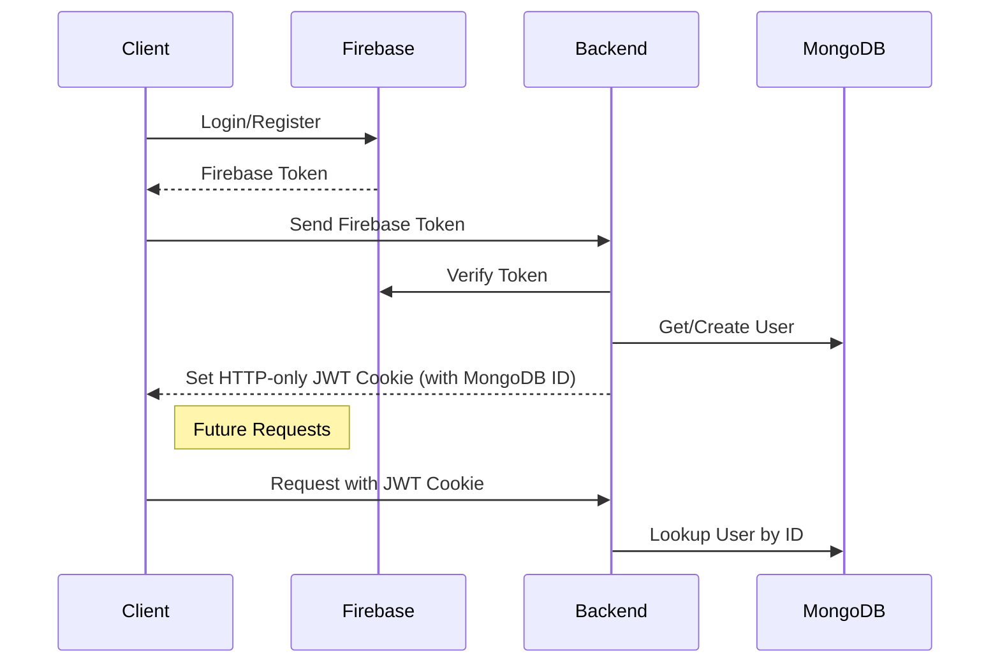

# Paperback Pals

**Connecting Friends Through Books**

## Overview

**Paperback Pals** is a unique platform that enables friends to share and borrow books from their personal libraries. By providing a structured and accountable process, it ensures a seamless borrowing experience while keeping track of book statuses and transactions.

**Note**: This is a portfolio demonstration project and includes basic security measures. In a production environment, additional privacy and security features would be implemented to comply with GDPR, CCPA, and other regulations.

## Features

- **Add Books**: Seamlessly add books to your library using the Google Books API with search and pagination.
- **Friend Management**: Search for and add friends using their usernames to expand your borrowing network. The same search bar is used for both friends and books.
- **Notifications**: Stay updated on request statuses for both friend requests and book transactions. Notifications are delivered in-app only.
- **Book Status Tracker**: Monitor the status of each book, from requested to returned.
- **Messaging**: Communicate with friends directly within the app through peer-to-peer conversations.
- **Library Browsing**: Explore books available in your friends' libraries through intuitive dashboard pages.

## Library Browsing Structure

- **Dashboard Page**:
  - Current Read Section
  - Books From Friends Section
  - Books To Friends Section
  - Pending Requests Section

- **Borrowing Page**:
  - Borrowed Books Section
  - Status Tracker for requested Books in active transit
  - Pending Requests Section

- **Library Page**:
  - Checked-In Books Section
  - Status Tracker for Owned Books in active transit
  - Checked-Out Books Section

## How It Works

The transaction process follows a clear and accountable workflow:

1. **Request**: A friend requests a book from your library.
2. **Acceptance**: You accept the request.
3. **Drop-Off Confirmation**: You confirm the book drop-off.
4. **Pick-Up Confirmation**: The borrower confirms the pick-up. The book is now "Checked Out" and assigned a due date.
5. **Return Initiation**: When the due date arises or the borrower is ready to return, the status changes to "Returning."
6. **Return Confirmation**: The borrower confirms the drop-off, and the owner confirms the pick-up. The book is now "Returned."

### Status Flow
- **CHECKED_IN**
- **ACCEPTED**
- **SENDING**
- **CHECKED_OUT**
- **IS_DUE**
- **RETURNING**
- **RETURNED**

### Transaction Workflow (Database Session Handling)

The book transaction process ensures data consistency and reliability through atomic database transactions using MongoDB sessions:

1. **Session Creation**: A session is started using `this.connection.startSession()`, ensuring that all database operations are executed atomically.
2. **Operations**: Actions like creating a book request and updating statuses are executed within a `withTransaction` closure. This closure wraps database operations, ensuring all are part of the same session.
3. **Database Modifications**: Changes (e.g., `userBooks`, `bookRequest`) are saved within the session. If any operation fails, the session is rolled back.
4. **Error Handling**: If an operation fails, the session automatically rolls back. If successful, the session commits the changes permanently.
5. **Session Cleanup**: After operations are complete, the session is ended to free resources.

## Authentication Flow

The authentication flow ensures secure login and communication between the client and server:



## Authentication & Security

- **Firebase Authentication** is used for secure login and account management.
- **JWT** tokens secure backend interactions.
- Sensitive data is encrypted and stored safely.
- Basic user privacy features implemented for demonstration purposes.
- For production deployment, additional privacy compliance features would be required.

## Real-Time Features

- **Socket.io** enables real-time updates, ensuring users are instantly notified of changes to book requests, statuses, or friend interactions.

## Tech Stack

**Client-Side:**
- React
- Redux Toolkit
- Axios
- Firebase
- Bootstrap
- Sass
- FontAwesome

**Backend:**
- NestJS
- Mongoose
- Passport (JWT Authentication)
- Firebase Admin SDK
- Socket.io
- Cloudinary (for media handling)

## Getting Started

### Prerequisites
- Node.js
- NPM/Yarn
- MongoDB

### Installation
1. Clone the repository:
   ```bash
   git clone https://github.com/yourusername/paperback-pals.git
   ```
2. Navigate to the project directory:
   ```bash
   cd paperback-pals
   ```
3. Install dependencies for both client and server:
   ```bash
   npm install
   ```
4. Set up environment variables:
   - Create a `.env` file with the necessary configurations for Firebase, MongoDB, and other services.

5. Start the application:
   ```bash
   npm start
   ```

## Contributing

Contributions are welcome! Please fork the repository, make your changes, and submit a pull request. Ensure your code adheres to the style guide and includes appropriate tests.

## License

This project is licensed under the MIT License. See the LICENSE file for details.

